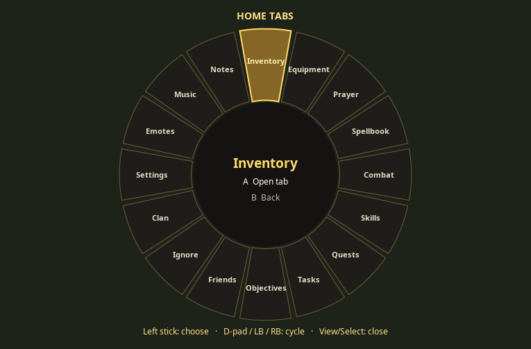

# SoloScape 2011+

A local, single-player-first RuneScape revision-634 project, exploring native
controller play and a console-style experience for Steam Deck. Built as a tracked
patch layer over the pinned 2011Scape/Void server and RuneLite-style client.

**Stage: playable console alpha on the development branch.** Local gameplay works and the owner
has confirmed camera, movement feedback and optional direct movement feel good.
There is no packaged release yet. Steam Deck performance, full interface coverage,
upstream content completeness and physical interface play still need acceptance. Isolated native save/reload and a gathering–production–combat route are verified.

This is a public, **maintainer-directed** development repository. Feedback and small,
agreed contributions are welcome. Scope and merges remain with the maintainer;
please discuss larger changes before starting. See [contributing](CONTRIBUTING.md).

## What works today

- Native SDL2 controller input, camera panning and configurable deadzones/speeds.
- Camera-relative destination walking, plus a reversible direct movement toggle
  using authoritative server steps, normal collision and run-energy rules.
- Ground movement feedback, target highlights, LT aim, LB/RB target cycling.
- A interactions, X native action menus, ground loot targeting and B cancellation.
- Inventory focus and dialogue navigation with native widget validation.
- A **16-slot home-tab radial proof of concept**: View/Select opens; left stick
  highlights; A opens the tab; B cancels. D-pad/LB/RB can cycle. Settings, spellbook,
  inventory, equipment and the other main slots share one wheel. Unavailable tabs
  are dimmed. Inventory, Equipment, Prayer and Spellbook now hand off to controller focus; Combat, Skills, Quests and supported Settings now also hand off; remaining tabs keep native mouse controls.
- Bank, deposit-box and shop panes, native quantities/actions, scrolling and tabs.
- A controller keyboard for quantities, names, text and native bank search.
- Equipment/prayer/spell focus and native item/spell targeting with explicit cancel.
- A separate eight-slot quick-action wheel for explicitly assigned food, potions, prayers and spells.
- Production amount presets, smithing/tanning/jewellery navigation, scaled controller overlays, Xbox/PlayStation labels and configurable menu buttons.
- Reversible custom inventory/equipment/bank/shop screens backed by native actions.
- Eight action bindings, conflict checks, Xbox/PlayStation/Deck presets and run thresholds.
- Graphical New/Continue launcher, controller character naming, isolated worlds, verified backups and owned-session recovery.
- Optional custom quest journal, skills, combat, prayer and spellbook screens with native state/details.
- Controller preferences/first-run setup from Home Settings, special-attack quick binding and source/target return.
- Session capability negotiation, interruption guards and reproducible client/server patches.



*Renderer preview at 765×503; this is not an in-game screenshot. Physical radial
acceptance remains pending.*

## Get started

The current development path is Linux x86_64 with a graphical X11/XWayland session.
You need Git, Python 3, Bash, curl, tar, util-linux/flock, 7-Zip for the cache archive,
and SDL2 2.0.22+ for controller support. The scripts install project-local JDKs;
first builds need network access to resolve Gradle dependencies.

```bash
git clone --branch overnight/controller-sprint https://github.com/kannibalk1w1/SoloScape.git
cd SoloScape
```

1. Follow the [development setup guide](README-SOLOSCAPE.md) to clone the exact
   upstream commits and install Java 21/8 locally.
2. **Download and install the compatible cache** using the
   [cache setup guide](docs/CACHE_SETUP.md). It includes the upstream-maintainer
   download link, verified archive name, extraction path and recorded SHA-256.
   The server cache is not bundled and is not fetched by simply launching the game.
3. Run `./scripts/doctor.sh`, then `./scripts/dev-run.sh` for the first build/launch. After building, `./scripts/launcher.sh` opens the graphical profile launcher; see [launcher instructions](docs/ALPHA_LAUNCHER.md).
4. **SoloScape Controller** starts enabled for fresh settings; an explicitly saved disabled preference is respected. **Tab radial menu**
   is on by default within that plugin; **Direct movement** is optional; enable **SoloScape server features** only for
   the patched server to use direct movement and position-free cancellation.
   **Native interface navigation** defaults on and can be disabled independently.
   **Quick-action wheel** defaults on: Start/Menu opens; all slots begin empty and X assigns the currently focused supported action. Home Settings opens controller preferences and first-run setup; Game Settings inside it opens native graphics/audio. Overlay size, labels, eight bindings, presets and independent custom-screen toggles are also available in plugin settings. New custom adventure screens default off.
5. Read the [controls and acceptance checklist](docs/CONTROLLER_TESTING.md).

After a successful build, `./scripts/dev-run.sh --no-build` uses existing jars.
A successful source build records patch/base and jar hashes. Rebuild both when
updating patches; missing or mismatched stamps reject `--no-build` with a rebuild
instruction.
The patched server defaults to IPv4 loopback; the profile launcher always binds and connects locally. Direct movement additionally requires a current-session capability acknowledgement.

## Current state and proposed work

- [Project handoff / current state](docs/PROJECT_HANDOFF.md): self-contained overview
  suitable for discussion in ChatGPT.
- [Proposed roadmap](docs/ROADMAP.md): checkbox task list, dependencies and acceptance.
- [Validation evidence](docs/VALIDATION.md) and [Claude's independent review](docs/CLAUDE_REVIEW.md).
- [Architecture](docs/ARCHITECTURE.md), [controller design](docs/CONTROLLER_DESIGN.md)
  and [upstream reconnaissance](docs/UPSTREAM_RECON.md).

The overnight sprint is on [`overnight/controller-sprint`](https://github.com/kannibalk1w1/SoloScape/tree/overnight/controller-sprint); see the [morning report](docs/MORNING_REPORT.md). Public `main` retains the earlier baseline until review.

Next: physically accept the custom-screen/profile build, fix recorded usability issues, then measure Deck performance and suspend behavior. Larger ambitions—solo adaptations, original graphics, persistent AI
adventurers, a local economy, selected backports and private co-op—remain proposals,
not implemented features or promised releases.

Latest journeys checkpoint: **176 client cases** (zero failures/errors, one optional SDL skip),
**62 root tooling/profile/lifecycle/recovery cases** and **20 selected game cases** pass.
Actual-map Restless Ghost, Cook’s Assistant and Rune Mysteries routes include native save/load.
Actual Swing character entry, real owned-server recovery and repeated graphical New/Continue pass;
physical controller/Deck acceptance remains open. See the [journeys task list](docs/CONTROLLER_JOURNEYS_TASKS.md),
[combined report](docs/MORNING_REPORT.md) and [journeys validation](docs/CONTROLLER_JOURNEYS_VALIDATION.md).

## Repository contents and contributions

`patches/` contains the client/server changes; `scripts/` manages setup and launch;
`docs/` records decisions, tests and future work. `upstream/`, `.runtime/`, game
cache, player saves, credentials, local settings and built jars are excluded.
No game assets or ready-to-run game package are distributed here.

Read [CONTRIBUTING.md](CONTRIBUTING.md) before proposing or submitting work.
Upstream licence notices and the current original-material licensing status are
in [THIRD_PARTY_NOTICES.md](THIRD_PARTY_NOTICES.md). SoloScape is independent and
not affiliated with Jagex, RuneLite or upstream maintainers.

Steam Deck checkpoint: private Desktop deployment/native save and recovery probes now pass. See [combined report](docs/MORNING_REPORT.md), [Deck setup](docs/DECK_SETUP.md) and [evidence/limits](docs/DECK_VALIDATION.md). Launcher keyboard ownership is implemented after physical feedback; Gaming Mode and in-game keyboard ownership remain acceptance/follow-up work.
