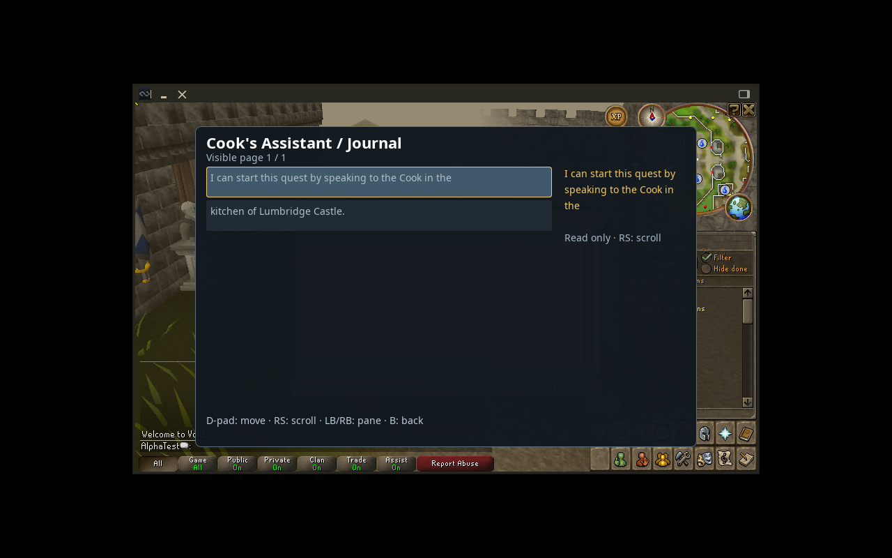
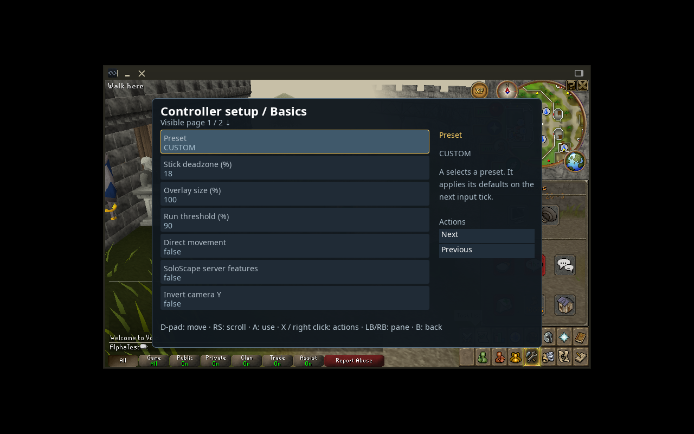

# Adventure native desktop validation

The opt-in `./scripts/smoke-profile.sh --adventure` uses a disposable profile/world and private home, loopback port 43595 and its own Xvfb chosen through `-displayfd`. It never selects another display. Its Java 8 harness runs the actual patched client against the actual server and compatible local cache. Saves, authentication data, raw logs and measurement JSON remain under ignored `.runtime/alpha-tests`; screenshots use the disposable AlphaTest account.

## What the probe exercises

- New and Continue each reach the rendered native world, ordinary introductory Continue and current-session capability acknowledgement.
- Loaded combat/prayer/skills/modern spellbook widgets expose real names/state/details. Wind Strike is observed with Magic 1, Air ×1 and Mind ×1; unavailable higher Magic is identified from current native level.
- The native Cook’s Assistant quest entry opens group 275; its unstarted journal has two loaded objective rows. The real custom renderer displays that native snapshot. This does not establish journal progress after completing every quest.
- The managed controller plugin’s real `openHomeTab` and settings Gateway adopt controller preferences across two update ticks. A real ConfigManager change/reversal restores deadzone, and synthetic B returns to Home ancestry. Without an SDL gamepad, the harness does not exercise the plugin’s SDL-driven `onClientTick`, physical input neutral rearming or first-run discovery.
- Ordinary mouse clicks open native Exit and Exit to Login using loaded, visible widgets, expected native labels and derived/clipped geometry. Logout reaches native login and clears negotiated capabilities. A four-second settling period allows the server’s queued player removal before one native login attempt. The same client returns with a different verified session nonce. Immediate reconnect during queued removal is not accepted by this test.
- New/Continue compare native saved account identity, XP, inventories and tile; completed-session backups are verified. Early content-loading cancellation compares every saved-world file byte for byte, including shared state. Original development saves/errors/derived paths retain their size/mtime fingerprint.

Exit/logout controls are outside ControllerUi’s actionable-record set. The harness therefore cannot require its same-frame Seen record; it uses loaded identity, visibility, native bounds and expected labels on the owned disposable display. Production controller actions continue using their normal fresh permission-gated dispatch.

## Completed run — 9 October 2026

Private evidence: `.runtime/alpha-tests/session-1791546756294194667/native-smoke-summary.json` (ignored local storage). Both native clients exited 0. Four completed-session backups verified. Account/XP/inventories/tile matched across New/Continue. Early startup cancellation preserved the entire saved world; original mutable-path fingerprints remained unchanged.

| Observation | New | Continue |
| --- | --- | --- |
| Complete session (s) | 66.282 | 63.783 |
| Adventure probe (s) | 39.6 | 39.039 |
| Baseline samples | 423 | 441 |
| Baseline median / p95 / p99 (ms) | 22.76 / 29.34 / 30.58 | 22.42 / 24.44 / 25.13 |
| Journal samples | 162 | 169 |
| Journal median / p95 / p99 (ms) | 30.43 / 32.68 / 34.65 | 29.12 / 31.48 / 36.48 |
| Baseline / journal maximum (ms) | 31.61 / 45.47 | 26.40 / 42.79 |
| Heap ready / after UI (MiB) | 76.6 / 207.3 | 125.2 / 211.5 |
| Client RSS after UI (MiB) | 887.6 | 814.5 |

In **both** sessions: `settings_gateway_two_tick_adoption`, `settings_config_round_trip`, `settings_back_to_home`, `same_client_relogin` and `fresh_capabilities_after_relogin` are true. The actual logged controls were Exit (746:172) and Exit to Login (182:10). Logout settled for 4.489 / 4.003 seconds before the one normal login attempt.

These actual native-client captures use the real custom renderer with loaded native snapshots, on the private virtual display. The settings capture exercises the real Gateway; it does not imply a connected physical controller. The journal is unstarted Cook’s Assistant, not completed quest progress.





## Measurement limits

The overlay records intervals between native overlay render calls, not isolated draw cost or GPU frame time. Baseline is a world/native-tab state; journal measurements include a different native modal state plus custom presentation. This is not a controlled same-scene A/B. Samples, median, p95, p99 and maximum are recorded to make follow-up reproducible.

Heap is read from MemoryMXBean at readiness and after UI/relogin; RSS from `/proc/self/status`. Native cache loading, JVM allocation and ordinary GC influence these short snapshots. No forced GC or long-duration leak experiment was performed. Complete-session times include readiness dwell, UI exercise, logout settling, relogin, save/shutdown and backup verification; they are not pure loading times or controller latency.

Steam Deck/Gaming Mode, GPU behavior, physical controller input, sustained performance, battery/thermals and suspend/resume require their own acceptance. These desktop observations establish a measured starting point, with no unsupported performance optimization claim.

## Reproduce

With an installed compatible cache and matched stopped-world build:

```bash
./scripts/prepare-build.sh
./scripts/smoke-profile.sh --adventure
```

Do not rebuild archives while another manually launched client/server uses them. The owned-session/build locks reject unsafe overlap. The probe compiles its Java harness outside tracked sources; no production test hook or fabricated gameplay packet is added. The root suite verifies the port probe rejects a live listener and permits native-style reuse after normal TCP TIME_WAIT.

Actual static review: [final review](CLAUDE_ADVENTURE_FINAL_REVIEW.md) and [follow-up](CLAUDE_ADVENTURE_FINAL_FOLLOWUP.md). [Route tests](ADVENTURE_ROUTE_AUDIT.md) are separate native-server walking/interaction tests; they do not imply physical controller acceptance.
