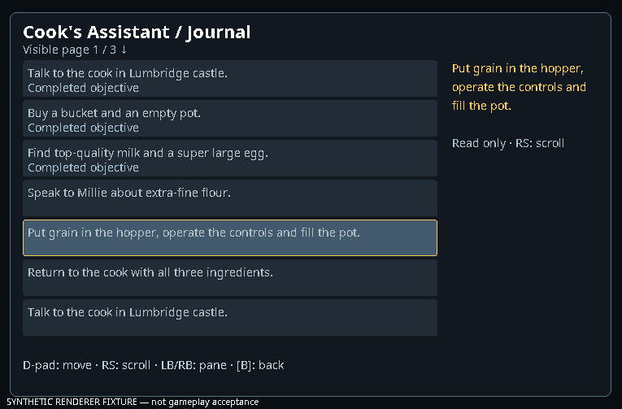
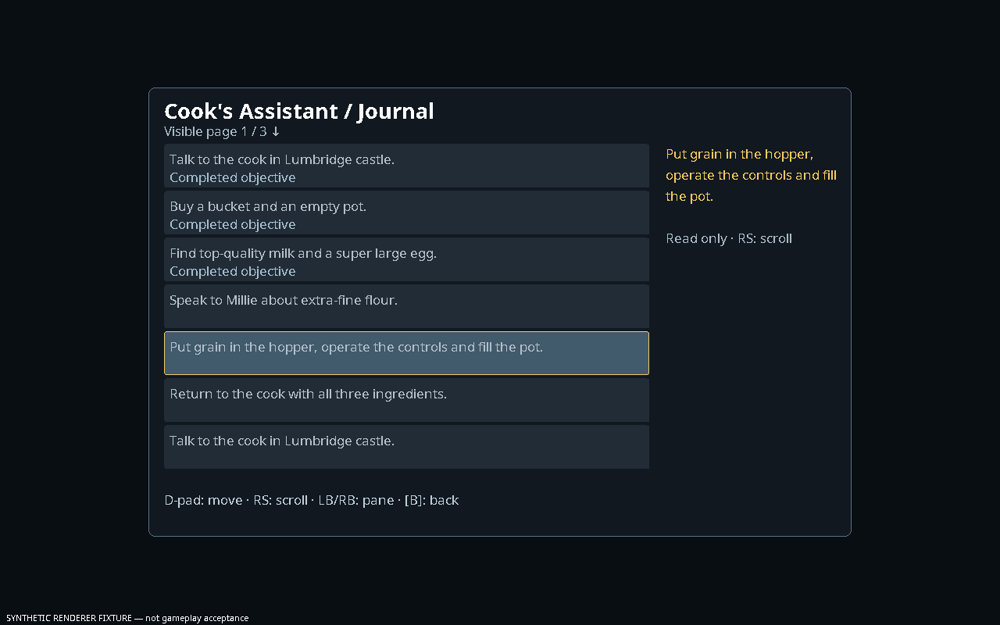

# Adventure screens — first batch

In the SoloScape Controller plugin settings, enable **Custom quest journal** and **Custom skills screen** independently. Both default off. Open Quests or Skills from the Home wheel, then select an ordinary native entry. Quest journals show visible native objective text and completion markers; skills show current boosted/base levels and XP. D-pad changes focus/pages, right stick scrolls, and B uses the existing menu ancestry. Read-only objective rows offer no invented actions.

This batch also adds shared typography, focus colours, full detail text, pointer tooltips and page direction hints. Native item artwork can reappear from cache hits after relog without rendering an extra model. Sprite references are weak and copied artwork is bounded. Native presentation stays available through each independent toggle.

**Custom combat screen**, **Custom prayer screen** and **Custom spellbook screen** are also independently reversible. Combat shows selected weapon style, retaliation and special energy/state. Prayer names, required levels, active state and quick-prayer selection follow the pinned definitions, including the different button/mask orders and curses. Spellbook names follow pinned component IDs. Spell level/rune requirements are read from the loaded cache information array using the same fields as server SpellRunes; missing/malformed information retains a readable fallback. A low current Magic level is identified without disabling or fabricating an action. Staff substitutions, additional skill/quest/target requirements and final casting availability remain game checks.

Focus the native Special attack **Use** control, open the quick wheel and assign it as usual. Its saved binding accepts only that exact combat component and a fresh native Use permission. It never changes energy or bypasses the server's weapon rules.

Verified after the spell requirements batch: client shadow jar and 172 tests, zero failures/errors, one existing optional SDL skip. Claude reviewed the foundation and confirmed its native fallback and sprite ownership fixes; the remaining journal newline cosmetic finding was also fixed. Live quest/skill guide layouts and physical controller usability still need acceptance testing.

These images use the actual overlay renderer with synthetic journal data, not a live gameplay capture:

