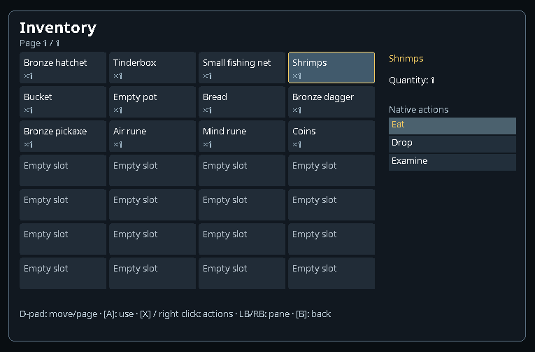

# Custom controller screens

Enable the SoloScape Controller plugin, then independently enable **Custom inventory screen**, **Custom equipment screen**, **Custom bank screen**, or **Custom shop screen** in its settings. Each defaults off; disabling it restores the native presentation immediately.

Open inventory with its controller binding or use the Home wheel. Open banks and shops through their normal world interactions. D-pad moves focus and changes pages; LB/RB switches native panes. A invokes the native primary action; X opens the action list, including supported quantity choices. Native bank Search and quantity prompts use the existing controller keyboard. Equipment offers worn items, available controls and fresh native bonus text. Hidden native bank rows still require ordinary native scrolling; the overlay never invents inaccessible items.

Mouse clicks and the wheel also work within the custom surface. Right click opens actions. Drop and Destroy require a second separate press on the same unchanged item within three seconds. Native actions are revalidated immediately before dispatch; item names, amounts, stock and permissions come from the game. Game and examine messages following an action appear in the custom screen. This feedback reports native messages, not guaranteed transaction completion.

The layout fits the original 765×503 canvas and scales to larger canvases. This is an early text-first interface with item names and quantities; item artwork and visual polish remain future work.

The preview uses the actual overlay renderer with synthetic inventory data, rather than a live inventory capture. Verification for this batch: 131 client tests, zero failures/errors, one existing optional SDL skip; client shadow jar built; full exported client patch stack verified across 71 files. Tests cover paging visibility, preserved native identity, stale actions, destructive confirmation, pointer focus and read-only equipment details. Physical controller usability and live bank/shop operation remain acceptance checks.
