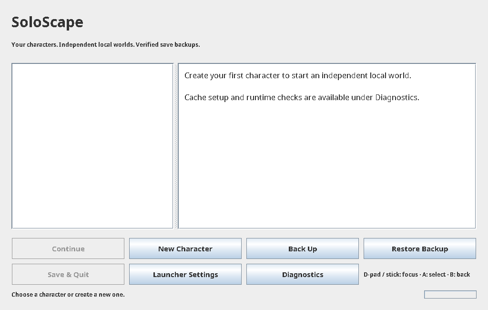
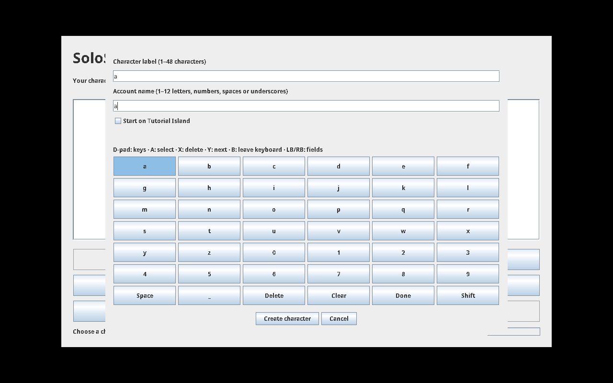

# Console alpha local-world launcher (development branch)

After the normal source/cache/runtime setup and a matched client/server build:

```bash
./scripts/launcher.sh
```

New Character creates a private local world under `.runtime/profiles/<id>/`. Continue
starts its server and client on IPv4 loopback, using private save/derived/log paths and
a private client home/cache. The launcher generates a local login credential file with
owner-only permissions; passwords are not placed in command arguments or metadata.
Existing legacy worlds are not migrated or changed by New Character.

The server binds before content loading is finished; the launcher waits for native world
readiness before connecting. Save & Quit, closing the game, or closing the launcher
stops only the owned processes, waits for normal shutdown hooks and verifies a backup.
There is no forced-kill timeout. A slow shutdown remains visible in session status.

Back Up/Restore Backup require a stopped profile. A restore validates the archive and
switches to a new save generation; the old generation is retained. Backups include the
world's exchange state and failed saves. Derived caches and routine logs are excluded.
Restore can recover a damaged character TOML; profile-manifest recovery and legacy-world
migration are still being strengthened and are not exposed in this launcher yet.

Launcher Settings selects a free game port. If an existing game already uses 43594,
choose another port (for example 43595); do not stop another session merely to test this
launcher. Gameplay controller settings remain in the SoloScape Controller plugin.
Controller navigation uses D-pad/stick, A to activate, B to return, and bumpers to move
between focus controls. New Character opens a controller keyboard for the label and account name: D-pad selects keys, A types, X deletes, Y advances, and B leaves the keyboard while keeping the form. LB/RB moves between form controls; Shift changes case. A second B closes the form. Desktop text entry also works; account names accept only native account characters. Failed creation keeps the form and entered values with an inline error.
Mouse and keyboard work throughout. Missing SDL is reported without blocking the UI.

Diagnostics checks pinned source, runtimes, cache presence and local port availability.
These presence checks do not prove cache/content compatibility. The official cache
source/setup instructions remain in the main README; no assets are redistributed.

Evidence so far: actual launcher rendered and closed successfully on a private Xvfb
display, without launching a game; private credential permission/origin tests; 30 root
protocol/profile/lifecycle tests. The screenshot below is an actual empty launcher,
not a gameplay or physical controller acceptance test.



The local port setting now persists in `.runtime/launcher-settings.json`; invalid ports do not overwrite it. Character details also show storage bytes, backup count and the preserve-history retention policy. Restore remains available for damaged profile manifests through verified backups. Gameplay controller settings live in each profile's private client home; new profiles may need the controller plugin enabled independently.

Session milestone update (9 October): `./scripts/prepare-build.sh` builds without starting a world. Manage Backups now provides exact previewed automatic-archive cleanup; manual/import/damaged/restore-source backups and generations are kept. Sessions hold archive locks through shutdown, so Prepare refuses while they are live. The current root suite has 44 cases; native New/Continue and observed early startup cancellation are verified on disposable worlds. See CONSOLE_SETUP_UPDATE.md and CONSOLE_BACKUP_RETENTION.md for current instructions.


## Recorded session recovery (10 October)

Owned sessions record a private session identity before starting their JVMs. Their inherited profile/archive locks stay held if the launcher crashes. On the next launch, an affected character offers **Recover Session** instead of Continue. Save & Quit sends graceful termination only after checking the boot, PID start, same user, session/role environment, exact archive argument, isolated save path and both inherited guards. It uses Linux pidfds, stops the client before the server and waits for normal hooks without a forced-kill timeout. A live original launcher, changed identity or suspended process is refused.

After recovery, the launcher validates a snapshot labelled `after-recovered-shutdown`, retains earlier backups, and explicitly says **clean shutdown is unconfirmed**. Disappearance alone does not establish a clean save. Save errors or unfinished save files keep the session record and previous backups for inspection.

For an ended session whose damaged save cannot be backed up, Recover Session offers **Archive ended record**. This requires no live owned processes and an available profile lock, preserves the record as `session.<id>.unverified.json`, and allows Restore Backup. Archiving does not verify the current save. Restore refuses an outstanding session record before changing generations.

Closing the backend with SIGTERM/SIGHUP now waits for its owned session worker and normal save hooks. Manual worlds and other launchers remain outside recovery ownership. Linux pidfd support is required for automatic recovery.

Current evidence: 62 disposable root cases; actual Swing keyboard/form/backend validation on an owned private Xvfb display. This exercises the entry adapter rather than a physical SDL controller. Real owned-server pidfd recovery/snapshot verification and repeated graphical New/Continue/save/cancel also pass on isolated storage. Clean recovered shutdown, native orphan-client and physical controller acceptance remain unclaimed. See [journeys validation](CONTROLLER_JOURNEYS_VALIDATION.md) for scope.


