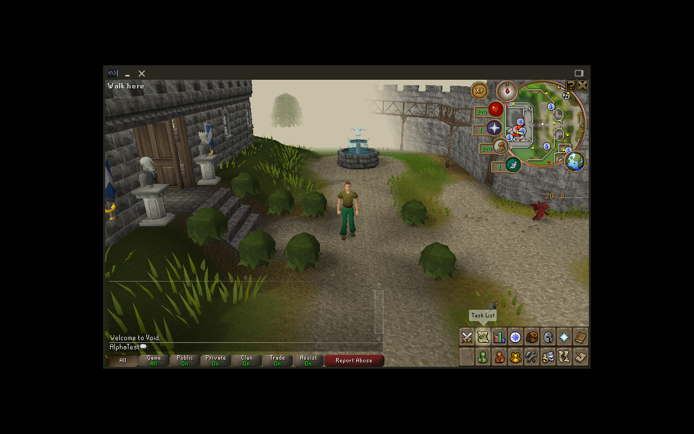

# Console alpha save/isolation foundation evidence

8 October 2026, development branch `overnight/controller-sprint`.

- Disposable Python profile fixtures: 10 recovery/isolation tests passing; existing
  tooling/lifecycle tests also pass (24 total). Original saves/cache not inspected.
- Patched server: config 74, network 249, selected engine 35 tests passing, no skips,
  failures or errors; `:game:shadowJar` succeeds. New coverage exercises failed
  serialization preservation, complete UTF-8 replacement, missing save parents,
  actual IPv4 loopback bind, failed-bind cleanup and environment precedence on reload.
- Server patch 0004 reproduces all 23 changed/patched source files from the pinned
  baseline; fresh apply, previous-stack upgrade, reverse and idempotence verified.
- Native character saves now use synced sibling temporary files and required atomic
  replacement. Exchange files retain upstream writes; complete world backups are
  taken only while the owned server is stopped, including exchange and failed saves.
- Profile restore validates archive paths, entry identity, hashes and native character
  structure, writes a new generation and atomically switches its manifest pointer.
  Old generations remain available. This does not yet prove gameplay save/reload.

Launcher integration and an independent Claude implementation review are in progress.
`import_character` currently copies one character only: world/exchange migration must
be strengthened before exposing migration in the launcher. Profile manifest corruption
requires additional recovery handling; damaged character TOML recovery is tested.

## Follow-up implementation and integration evidence

- Claude's implementation review is recorded in `CLAUDE_ALPHA_SAVE_REVIEW.md`.
  Its oversized-request finding is fixed and covered by a protocol regression test.
  Exchange/report files now also use synced atomic replacement; obsolete per-item
  offer files are retired after replacements are written. **This is per-file durability,
  not an atomic transaction spanning all account and exchange files.** Stopped-world
  backups remain the recovery boundary for the complete world.
- Root tests now total 30 passing cases. Client tests: 123, no failures/errors, one
  existing SDL virtual-controller skip. Client/server jars build successfully.
- A disposable native client/server session on private Xvfb/port 43595 logged in,
  produced a structurally valid account save after normal shutdown, continued, and
  preserved tested account/XP/inventory/location fields. Four verified world backups
  were created over the two sessions. Original save/error/derived-file size/mtime
  snapshots were unchanged. This checks native login/save paths, not graphics or
  human controller acceptance; the first captures still showed scene loading.
- Server patch 0006 adds a native content-handler route fixture with every mutable
  fixture path explicitly isolated through `SOLOSCAPE_TEST_ROOT`:
  **level-one net fishing → cook gathered shrimp → wield bronze sword → defeat chicken
  → eat cooked food → SaveQueue/FileStorage save → native PlayerSave reload**.
  No fish, food, XP or combat loot is injected; only starting tools and nearby test
  objects/NPCs are seeded. Validated interface/NPC/item instructions drive the actions.
  Deterministic valid RNG rolls remove chance; assertions check output items, XP,
  equipment, bones, food consumption and saved/reloaded fields. One complete route
  passes. This fixture does not simulate controller travel through the full map.

To repeat the isolated content fixture after building/applying patches:

```bash
source config/local.env
export JAVA_HOME="$(dirname "$(dirname "$SERVER_JAVA")")"
export GRADLE_USER_HOME="$PWD/.gradle"
export SOLOSCAPE_TEST_ROOT="$PWD/.runtime/alpha-tests/content-route"
(cd upstream/game-server && bash gradlew --offline --no-daemon :game:test --tests '*AlphaProgressionTest')
```

The fixture deliberately skips without an explicit isolated test root. A longer
checked-in graphical smoke harness is being validated separately before publication.

## Graphical native smoke harness: passed

`./scripts/smoke-profile.sh` now provides a repeatable New Character/Continue check.
It compiles the small native probe, creates an independent test profile below
`.runtime/alpha-tests/session-<id>/`, starts owned server/client processes on port 43595
and a private Xvfb display :197, and repeats clean shutdown/save twice. It requires a
matched source build, the existing compatible cache, Xvfb and a free test port/display.

The probe waits at least 15 seconds and requires native world readiness and freshly
rendered home-tab availability. It continues new-character welcome dialogue only
through a fresh ordinary native Continue action. It records diagnostic state flags
and a screenshot from the private display; no production diagnostic socket is exposed.
The test fails closed if startup/login/readiness/save-field checks fail.

Both iterations pass: native character save valid, inventory/XP/location preserved,
four backups verified and original save/error/derived-path size/mtime snapshots unchanged.
The final state has no dialogue or modal entry and no pending scene load. The following
is the actual software-rendered disposable world, not a mockup or a controller/hardware
acceptance claim.



### Damaged profile metadata recovery

The launcher backup list and Restore action now also work when `profile.json` is missing, invalid JSON, or points at a missing generation. Recovery derives the account identity from a fully verified backup belonging to the same profile directory, retains any damaged manifest under a unique private filename, writes a new generation, and atomically installs a new manifest. A locked/running profile is refused. Original generations and private login credentials remain unchanged. Tests use temporary copies and cover damaged/missing manifests, active locks, malformed archives and failed-import cleanup.

Metadata reports total profile storage bytes, backup count and the current retention policy. Backups and previous generations are deliberately retained; there is no automatic deletion of history in this alpha. Disk use must be monitored until an explicit retention interface is added.

### Import an independent stopped-world copy

Run `python3 scripts/import-profile.py /path/to/stopped-world-saves-copy --label "My character" --account "AccountName"`. The source must be an independent copy made while its server was stopped, outside the upstream data directory. This command copies every regular world-save file, validates all character TOMLs, retains other accounts and exchange records, and creates a verified initial backup. It refuses links, oversized data and detected source changes. It never alters the source.

Native authentication hashes remain byte-for-byte unchanged. By default, login stays manual and requires the original password. Add `--remember-password` to enter that existing password privately for local automatic login; it is kept only in the profile's mode-600 login file, never on the command line or in metadata. Import does not reset, bypass or verify a forgotten password. Do not import a directory being written by another process; per-file change detection is an additional check, not a filesystem snapshot transaction.
