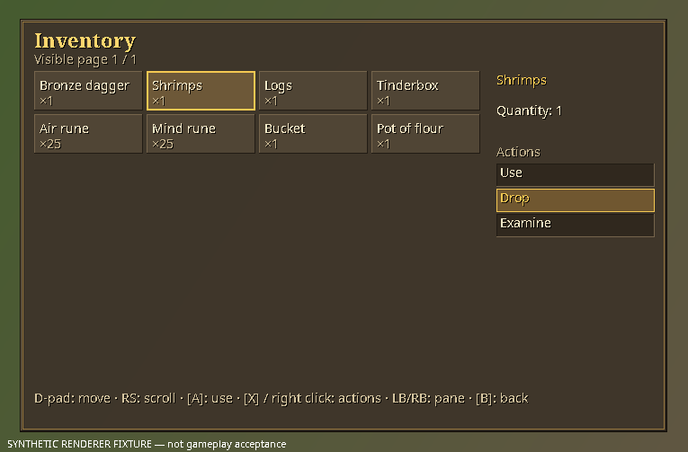
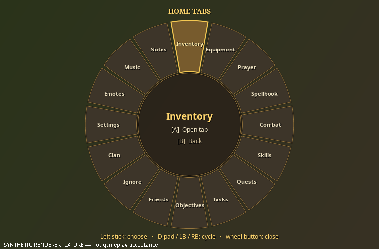
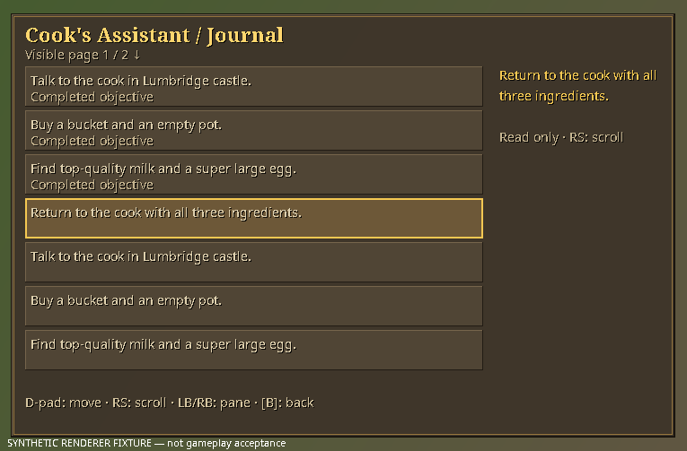

# Classic controller UI palette

This restyles the custom controller surfaces toward the 2011/OSRS look: warm stone, parchment,
brown and gold. I made the changes in parallel with the integration work.

The integration build and synthetic previews pass. Runtime and physical acceptance are recorded separately in the sprint report.

## Files changed
In `upstream/runelite-client/client/src/net/runelite/client/plugins/soloscapecontroller/`:
- `ControllerTheme.java`: the palette switch, both palettes, and the shared frame, cell, action,
  label, text, wedge and hub helpers.
- `SoloScapePanelOverlay.java`: colour and frame calls only.
- `SoloScapeTabRadialOverlay.java`: colour, wedge and hub calls only.
- `SoloScapeQuickRadialOverlay.java`: colour, wedge and hub calls, plus the guide box.

New files:
- `scripts/harness/ClassicUiPreview.java`: an optional synthetic preview.
- `docs/CLASSIC_CONTROLLER_UI.md`: this file.

Nothing else was touched: no plugin, config, entry, native, `SoloScapeUiOverlay`, test, patch,
script or runtime file.

## Integration API
- `ControllerTheme.classic(boolean)` selects the palette. **Classic is the default** (a static
  initializer calls `classic(true)`). `false` restores the earlier modern palette exactly,
  including the colours that the overlays used to hard-code.
- `ControllerTheme.classic()` reports the current palette.
- The existing public names `BACKGROUND`, `BORDER`, `CELL`, `SELECTED`, `FOCUS`, `TEXT`, `MUTED`,
  `COMPLETE`, `body(scale)` and `heading(scale)` are kept, so `SoloScapeUiOverlay` compiles
  unchanged and follows the toggle.
- The colour fields changed from `static final` to `static volatile`. That is source- and
  binary-compatible for readers.
- Overlays read the palette at paint time, so a config toggle takes effect on the next frame
  without restarting. A toggle in the middle of a frame can mix the two palettes for at most one
  frame.

## Design decisions
- **Geometry is untouched.** Every helper draws inside the rectangle or shape it is given:
  - the panel and tooltip boxes;
  - each widget's `bounds`;
  - each action row's exact hit `Rectangle`;
  - the unchanged wedge and hub shapes.

  No offsets, sizes, page sizes or scroll logic changed. `paint()` returns the same action
  bounds, so mouse hit maps, native action tokens, IDs and focus semantics are unchanged.
- **The body font is unchanged** (sans-serif, same sizes) because its line height positions the
  action hit boxes. Only the title font (`heading`) and the "HOME TABS" heading use a bold serif
  in classic mode. They are never used for layout; the title is only fitted to the width.
- **Classic surfaces:**
  - **Panels:** a dark warm-stone fill with a near-black outer line, a one-pixel bevel (lighter
    top-left, darker bottom-right) and a thin bronze trim inset by three pixels. Corners are
    square, as in the 2011 interface.
  - **Cells:** a slightly lighter stone with a one-pixel bevel. A **selected** cell gets a warmer
    fill and a **two-pixel gold frame**, drawn inside its bounds.
  - **Action rows:** a dark recessed wood, with the bevel inverted. The selected row has a warm
    brown fill and a one-pixel gold outline.
  - **Text:** cream body text, gold titles and focus, and a muted parchment colour for secondary
    text. All of it has the classic one-pixel black drop shadow for readability over busy
    scenes. The shadow is cosmetic and doesn't move the text.
  - **Tooltips:** a parchment background with dark brown text and a brown border, like the
    in-game examine and hover style.
  - **Radials:** stone wedges with a dark edge and bronze trim. The selected wedge has a warm
    bronze fill and a two-pixel gold edge. The hub disc has a dark rim and gold ring. In classic
    mode the quick wheel also gets the hub disc; in modern it still has none.
  - **The controller guide box** reuses the panel frame.
- **Modern mode** draws exactly as before, including the rounded corners, the one-pixel edge on
  the quick wheel's selected wedge and the absence of text shadows.
- **Everything is drawn in code** with Java2D shapes and fonts. There are no external images,
  textures, fonts or generated assets. Item icons still come from the client's own sprite path.

## Preview (optional)
`ClassicUiPreview` uses only synthetic fixtures. It writes inventory, journal, tab-wheel and
quick-wheel PNGs for both palettes at 765×503 and 1280×800:

```
javac -cp <void-client jar> -d <dir> scripts/harness/ClassicUiPreview.java
java -cp <void-client jar>:<dir> ClassicUiPreview <output dir>
```

It shows the surfaces only. Item icons are blank; the integration fixture refreshes synthetic tab availability before painting.

## Limits
- Claude implemented this pass without running builds; the integration owner compiled and rendered it afterwards. There
  is no `var`, no Java 9+ APIs, and no field initialized after the static block that reads it
  (`SHADOW` is declared before it). The toggle-to-config wiring and a test of
  `classic(false)`/`classic(true)` belong to the integration owner.
- Contrast was chosen for readability (cream on dark stone), but it hasn't been checked on a real
  Deck panel or at small `overlayScale` values.
- The integration owner also adopted shared text colours in the native entry/context overlay.
- No gameplay, physical controller, Steam Deck or GPU acceptance is claimed.

## Integration checkpoint

The integration owner added the reversible **Classic controller UI** preference (default on) to plugin configuration and Home → Settings → Basics. The theme setter skips unchanged values rather than allocating colours every input tick. Native entry/context text now adopts the shared cream text colour, and the new system text panel uses the shared frame/cell helpers.

The synthetic preview now refreshes tab availability before painting, so the Home wheel shows enabled labels. The harness compiles/renders against the real client jar at 765×503 and 1280×800 for both palettes, including the text-entry panel. These images have been visually inspected for layout/readability; they contain synthetic text and blank item icons, not game/cache artwork or gameplay acceptance.






